# Socialify App

### This project is a web application for managing user profiles and posts.

## Technology used

- Node
- Express
- Mongo
- React
- Chakra UI

## Features

- User management: Create, read, update, and delete user profiles
- Post management: Create, read, update, and delete posts
- Post analytics: View total number of posts and top 5 most liked posts
- User analytics: View total number of users and top 5 most active users

### Screenshots

##### Register User

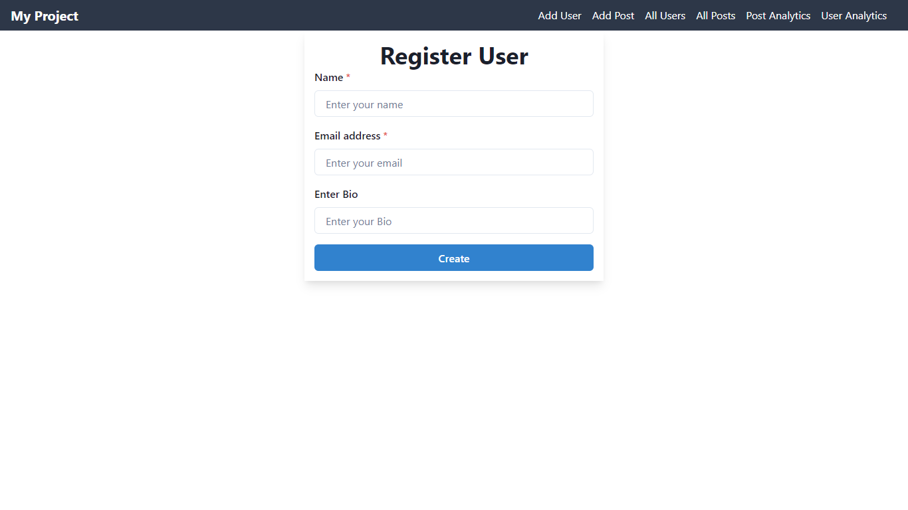

##### Add Post

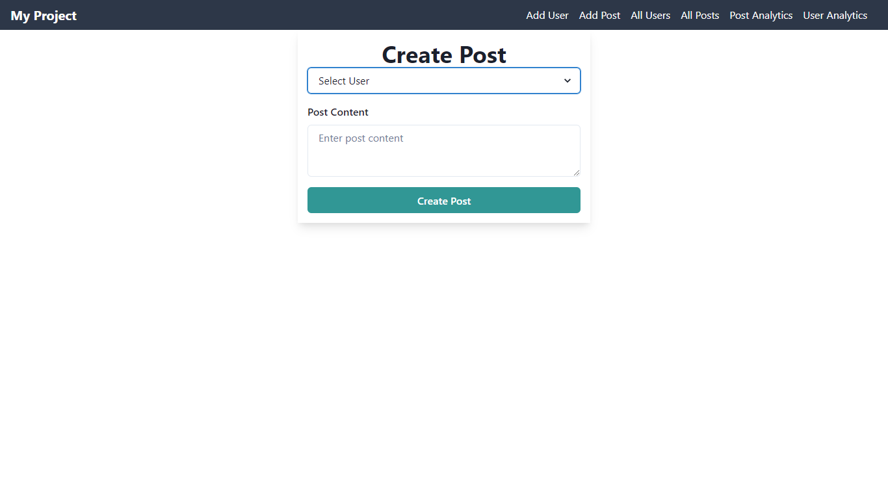

##### Post Lists

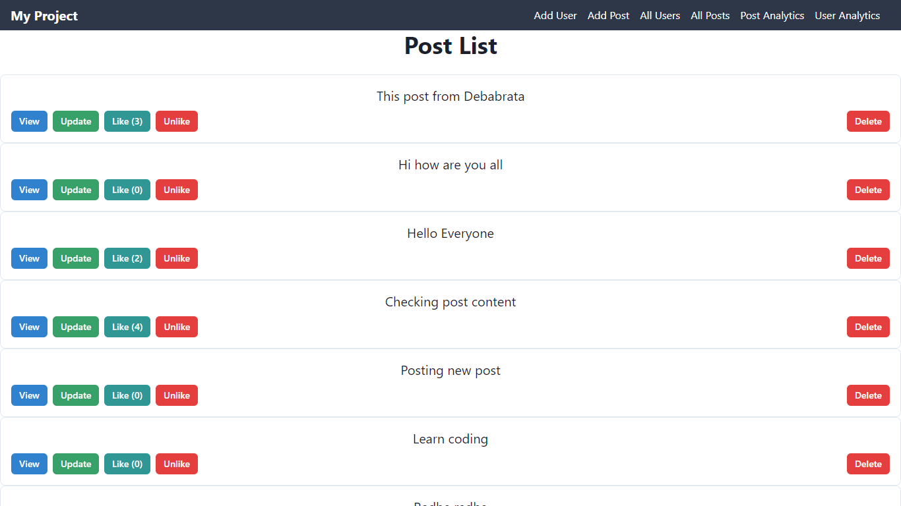

##### Post Lists - Post info

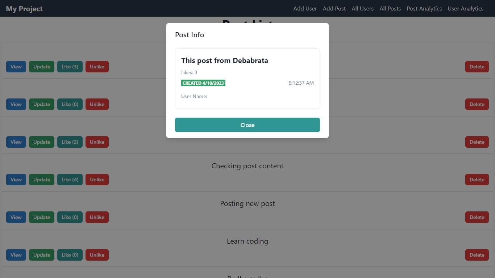

##### Post Lists - Delete Post

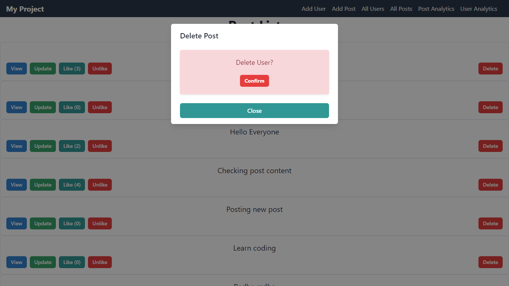

##### User Lists

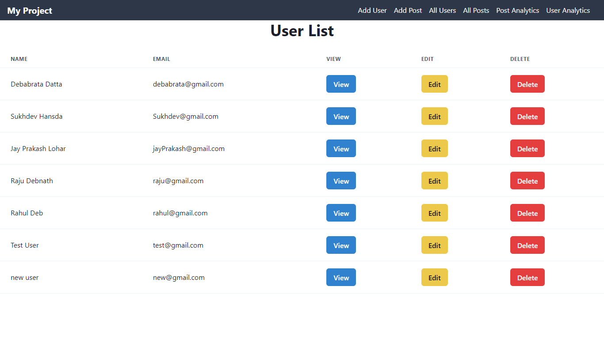

##### User Lists - User info

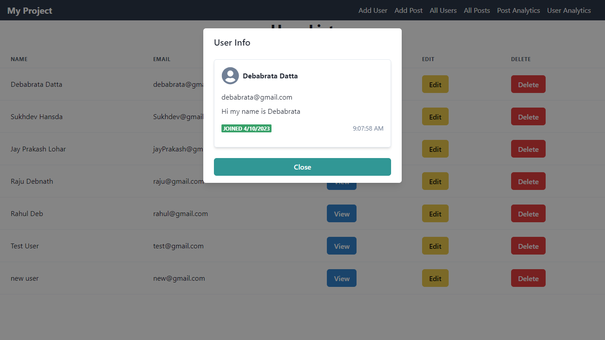

##### User Lists - update user

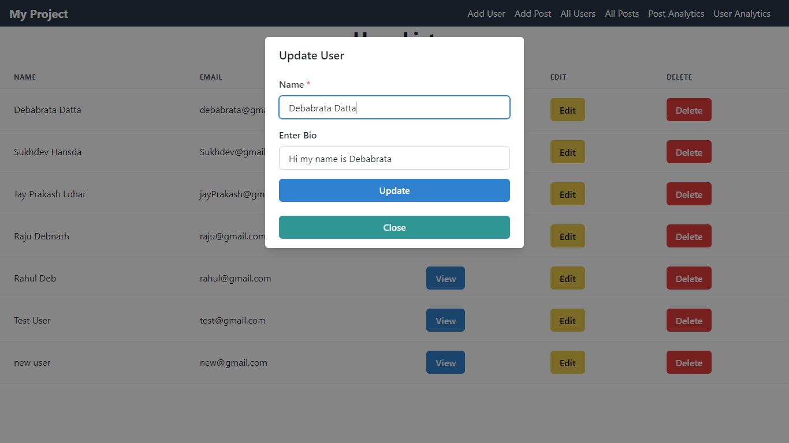

##### User Lists - delete user

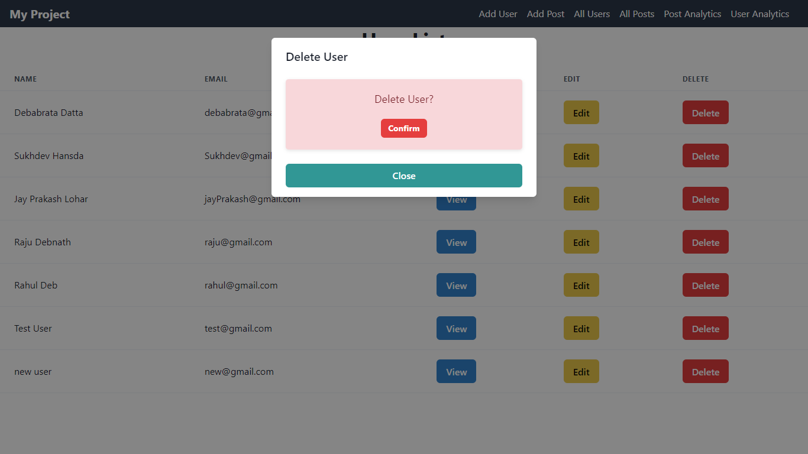

##### User analytics

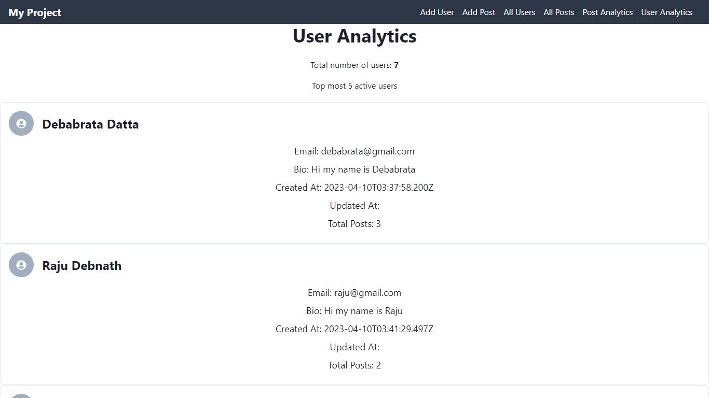

##### Post analytics

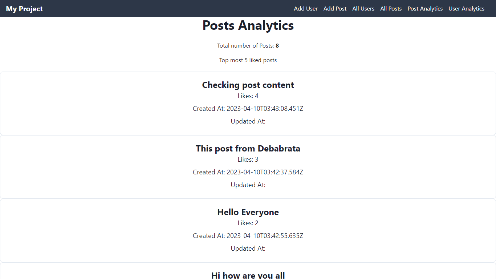

## Getting Started

-> To get started with the project, follow these steps:

1. Clone the repository to your local machine.
2. Install the required dependencies by running npm install.
3. Start the backend server by running npm run start.
4. Start the frontend server by running npm run start:client.
5. Open your browser and navigate to http://localhost:3000 to view the app.

## Usage

Once you have the app running, you can use it to create, read, update, and delete user profiles and posts. You can also view post and user analytics on their respective pages.

# Deployed Link

### Frontend

https://socialify-sand.vercel.app/

### Backend

https://socialify.up.railway.app/
